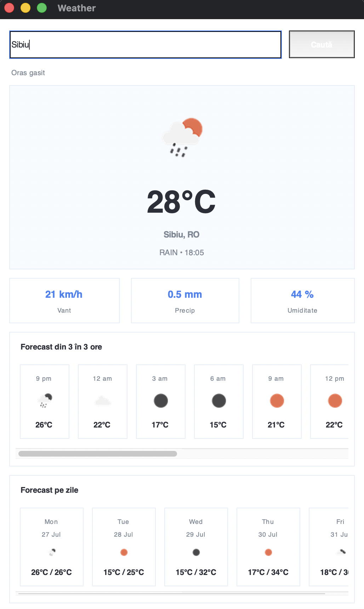
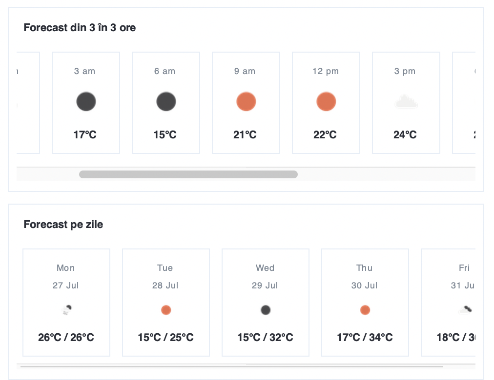

# Python Weather Dashboard

A desktop weather application built with **Python** and **Tkinter** that retrieves current conditions and forecast data from the **OpenWeather REST API**.

The application allows users to search for any city and view current temperature, weather conditions, local time, wind speed, precipitation, humidity, an hourly forecast and a multi-day forecast in a clear card-based interface.

## Features

- Search for weather information by city name
- Display current temperature and weather conditions
- Show the searched city's local time
- Display wind speed, precipitation and humidity
- Show a scrollable forecast at three-hour intervals
- Calculate daily minimum and maximum temperatures
- Display weather icons based on API conditions
- Handle invalid city searches with user-friendly error messages
- Use request timeouts and defensive JSON parsing
- Read the API key securely from an environment variable

## Screenshots

### Current Weather Dashboards

The interface updates dynamically according to the selected city and the weather information returned by the API.

<p align="center">
  
  
</p>

### Weather Measurements

The dashboard displays wind speed, precipitation and humidity in separate summary cards.

<p align="center">
  
</p>

### Hourly and Daily Forecast

Forecast information is presented both at three-hour intervals and as a multi-day overview with minimum and maximum temperatures.

<p align="center">
  
</p>

### Error Handling

When a city cannot be found, the application displays a clear error dialog instead of failing unexpectedly.

<p align="center">
  
</p>

## Technology Stack

- **Python 3.11+**
- **Tkinter** for the desktop user interface
- **Requests** for HTTP communication
- **Pillow** for image processing and weather icon resizing
- **OpenWeather REST API** for current weather and forecast data
- **JSON** for API response processing

## How It Works

1. The user enters a city name.
2. The application sends a request to the OpenWeather API.
3. The returned JSON data is validated and processed.
4. Timestamps are converted to the searched city's local time.
5. Current weather information is displayed in the main dashboard.
6. Forecast entries are grouped into hourly and daily views.
7. Weather icons are downloaded, resized and cached in memory.

## Requirements

Before running the project, make sure you have:

- Python 3.11 or newer
- An OpenWeather API key
- Internet access

## Installation

### 1. Clone the repository

```bash
git clone https://github.com/dianuca/weather-dashboard-python.git
cd weather-dashboard-python
```

### 2. Create a virtual environment

On macOS or Linux:

```bash
python3 -m venv .venv
source .venv/bin/activate
```

On Windows:

```powershell
python -m venv .venv
.venv\Scripts\activate
```

### 3. Install the dependencies

```bash
pip install -r requirements.txt
```

### 4. Configure the API key

Create an API key through OpenWeather and store it in the `OPENWEATHER_API_KEY` environment variable.

On macOS or Linux:

```bash
export OPENWEATHER_API_KEY="your_api_key"
```

On Windows PowerShell:

```powershell
$env:OPENWEATHER_API_KEY="your_api_key"
```

### 5. Run the application

```bash
python app.py
```

Depending on your macOS Python installation, you may need to use:

```bash
python3 app.py
```

## Project Structure

```text
weather-dashboard-python/
├── app.py
├── requirements.txt
├── screenshots/
│   ├── barcelona-weather-dashboard.png
│   ├── sibiu-weather-dashboard.png
│   ├── weather-metrics.png
│   ├── hourly-daily-forecast.png
│   └── invalid-city-error.png
├── .gitignore
└── README.md
```

## Technical Details

The OpenWeather forecast endpoint returns entries at three-hour intervals. The application processes these entries to create two different forecast views:

- an hourly sequence of upcoming conditions;
- a daily overview containing minimum and maximum temperatures.

Forecast timestamps are converted using the timezone offset returned for the searched location. Weather icons are downloaded only when needed, resized with Pillow and cached during the application session.

## Error Handling

The application handles several possible problems, including:

- empty city input;
- cities that cannot be found;
- unavailable network connections;
- API request timeouts;
- incomplete or unexpected API responses;
- missing API configuration.

## Security

The OpenWeather API key is loaded from the `OPENWEATHER_API_KEY` environment variable.

Do not write the real key directly in the source code and do not commit `.env` files or private credentials to GitHub.

## Future Improvements

- Translate the entire application interface into English
- Run API requests in a background thread to keep the interface responsive
- Add Celsius and Fahrenheit preferences
- Add saved and favourite cities
- Add automatic location detection
- Add unit tests for forecast aggregation and timezone conversion
- Improve responsive behaviour for different screen sizes

## Author

**Diana Ciodolan**

Computer Science graduate and master's student in Advanced Information Systems and Technologies.
