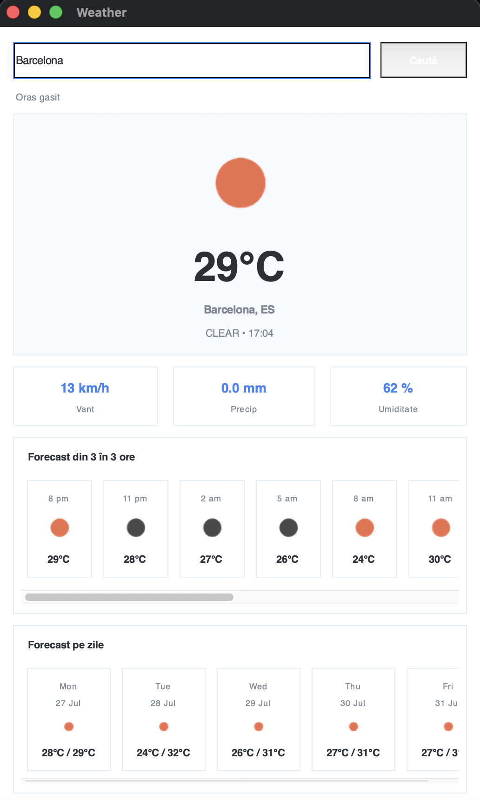

# Python Weather Dashboard

A desktop weather dashboard built with Python and Tkinter. It retrieves current conditions and forecast data from OpenWeather, converts timestamps to the searched city's local time and presents the results in a card-based interface.

## Features

- Search weather by city name
- Current temperature, conditions and local time
- Wind speed, precipitation and humidity
- Scrollable 3-hour forecast for the next 36 hours
- Aggregated five-day minimum and maximum temperatures
- Weather icon downloading, resizing and in-memory caching
- Reusable HTTP session and request timeouts
- Defensive JSON parsing and user-friendly error handling

## Technology stack

- Python 3.11+
- Tkinter
- Requests
- Pillow
- OpenWeather REST API

## Run locally

1. Create an OpenWeather API key.
2. Clone the repository and create a virtual environment:

```bash
python -m venv .venv
source .venv/bin/activate
```

On Windows, activate it with `.venv\Scripts\activate`.

3. Install dependencies:

```bash
pip install -r requirements.txt
```

4. Set the API key:

```bash
export OPENWEATHER_API_KEY="your_api_key"
```

On Windows PowerShell:

```powershell
$env:OPENWEATHER_API_KEY="your_api_key"
```

5. Start the application:

```bash
python app.py
```

## Technical notes

The OpenWeather forecast endpoint returns data at three-hour intervals. The application groups these entries by the target city's local calendar date to calculate daily minimum and maximum temperatures and select a representative weather icon.

## Security

The API key is read from the `OPENWEATHER_API_KEY` environment variable and must never be committed to GitHub.

## Future improvements

- Translate the remaining interface labels and comments into English
- Move network requests to a background worker
- Add unit tests for forecast aggregation and timezone conversion
- Add saved locations and unit preferences

## Author

**Diana Ciodolan**

## Screenshots

### Current Weather Dashboard

The main dashboard shows the current weather for a searched city, including temperature, weather condition, wind speed, precipitation and humidity.


### Alternative Weather Conditions

The interface updates dynamically based on the API response and displays different icons, values and forecast information for other cities and weather conditions.



### Hourly and Daily Forecast

In addition to current conditions, the application provides both short-term hourly forecasts and a multi-day weather outlook.


### Error Handling

Invalid user input is handled gracefully with a clear error dialog when a city cannot be found.


